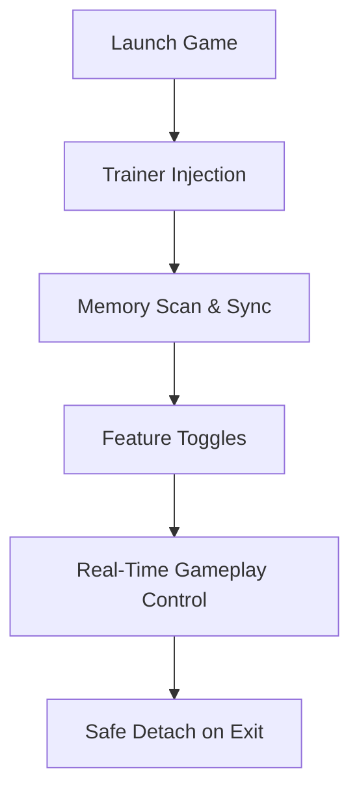

## 🌍 Introduction

There is a certain poetry in digging downward. Each block removed is a choice, each descent a quiet wager with danger. **Dig, Dig, Die** thrives on this tension — hunger ticking, enemies lurking, darkness pressing close.

The **Dig, Dig, Die Trainer** is not here to silence the game’s voice, but to let you decide its tempo. Faster. Kinder. Or mercilessly efficient. This is a precision tool for players who want command over systems, not shortcuts without thought.

---

## 🧭 Overview

The trainer functions as a real-time gameplay controller for Dig, Dig, Die on Windows PC. It injects a lightweight overlay that lets you toggle survival mechanics, tune excavation speed, manage resources, and explore builds that would otherwise take dozens of risky runs.

Think of it as a lantern in the deep: not removing the dark, but giving you clarity within it.

**Core philosophy:**

* Respect the original mechanics
* Enable experimentation without punishment
* Preserve immersion and performance

---

## ✨ Key Capabilities

### ⛏️ Resource & Digging Control

* Infinite stamina for uninterrupted excavation
* Adjustable mining speed (x1–x10)
* No tool durability loss
* Instant block break toggle

### ❤️ Survival & Health Systems

* God mode (toggleable, non-intrusive)
* Freeze hunger & thirst values
* One-hit immunity with damage scaling
* Environmental hazard resistance

### 👁️ Awareness & Visibility

* Underground enemy highlights
* Chest & loot vein indicators
* Fog-of-war soft reveal (non-map-breaking)

### ⚙️ Time & Progression Tweaks

* Game speed controller (slow-motion or fast-forward)
* XP multiplier with caps
* Skill cooldown bypass

> 💡 These modules are fully modular — enable one, combine three, or sculpt a completely new rhythm of play.

---

## 🚀 Quick Start Setup ⚡

1. Launch **Dig, Dig, Die** normally
2. Run the trainer as Administrator
3. Wait for process detection confirmation
4. Use hotkeys or overlay menu to toggle features

```text
Default Hotkeys:
F1  → God Mode
F2  → Infinite Stamina
F3  → Speed Control
INS → Overlay Menu
```

> [!IMPORTANT]
> Start the trainer **after** the game reaches the main menu for best stability.

---

## 🔁 How It Works (Conceptual Flow)



Each feature hooks only its required values — no blanket memory overwrite, no bloated scans. Elegant, quiet, deliberate.

---

## 🛡️ Safety & Stability

This trainer is designed for **single-player experimentation**.

* No network calls
* No telemetry
* No kernel drivers

> [!WARNING]
> Do **not** use in shared, competitive, or leaderboard-validated environments.

For personal runs, creative testing, or accessibility needs — it remains calm and reliable, even in long sessions.

---

## ❓ FAQ

**Q: Will this ruin the intended challenge?**
Not unless you let it. Many players use only speed control or stamina tweaks to reduce grind, not danger.

**Q: Can I use it for accessibility reasons?**
Absolutely. Hunger timers, speed modifiers, and visibility options are often used to tailor the game for comfort.

**Q: Does it work after updates?**
Minor patches are usually supported automatically. Major updates may require a quick signature refresh.

**Q: Is there a risk of save corruption?**
The trainer does not write to save files. All changes are runtime-only.

**Q: Can features be hot-swapped mid-run?**
Yes. Toggle freely without restarting the game.

---

## 🌌 Final Thoughts

Digging is a dialogue between curiosity and fear. The **Dig, Dig, Die Trainer** simply hands you the punctuation. Pause where needed. Accelerate when inspired. Strip the grind from experimentation and let intention guide your descent.

For builders, testers, explorers, or weary survivors — this tool reshapes the underground into something personal.

---
